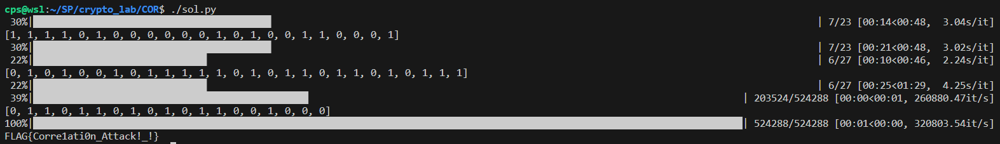
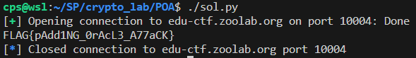
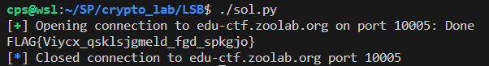
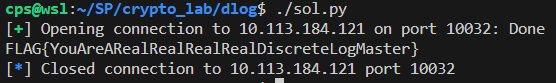
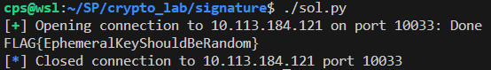
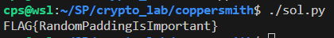

# Crypto Lab Writeup

- 學號：`109550206`

## COR

- Flag：`FLAG{Corre1ati0n_Attack!_!}`

### 解題流程與思路
將三個 LFSR 以此 `x2 if x1 else x3` 非線性方式組合起來的話，其實 `x2` 和 `x3` 有 `75%` 的機率會與最後結果一樣，因此可以先對 `x2` 和 `x3` 其進行爆搜，若對的話會接近 `75%` 與結果一致，那很有可能就是對的，否則相似度應該只在 `50%` 左右。有這個兩個結果再枚舉 `x1`。其複雜度或被拆成三個的加法，而非乘法。

**解題過程：**
1. 可以看到其 `COR.py` 其 `output` 中前 `200` 個是 `triLFSR` (`x2 if x1 else x3`) 直接生的，因此可以推測其與 `x2` 和 `x3` 有 `75%` 像，且其前 `x (23, 27)` 個應該也有 `75%` 像，因此可以以此作為枚舉 `key` 的起點可以更快找到。
2. 爆搜完 `lfsr2` 、 `lfsr3`，即可再爆搜 `lfsr1`，找到與前 200 個一樣即找到 `key`。
3. 三個 `lfsr` 的 `key` 都找到即可以自己生其原樣，並與 `output` xor，即可求得 flag。
4. 參照 `COR/sol.py` 的實現。
**取得 flag 的畫面：**


## POA

- Flag：`FLAG{pAdd1NG_0rAcL3_A77aCK}`

### 解題流程與思路
可以看到 server 會回傳是否成功解出來 (padding 是否正確)，因此可以透過枚舉 iv 的每一個 byte 使其與 cipher decrypt 出來的東西通過 padding，以此猜出 cipher decrypt 出來的東西，即可得到明文。且因其使用 CBC mode，則其每一個 block 的 iv 即為前一個 block 的 cipher，第一個 block 的則是 iv。

**解題過程：**
1. 觀察題目的 padding `[0x80] + [0x00] * (15 - len(data) % block_size)`，會發現若最後是 `0x80` 會有問題，但我們知道其解出來為 `FLAG` 皆為可視字元，因此枚舉時只 try 128 ~ 256。
2. 對每個 block 都做一次 padding oracl attack。
3. padding oracl attack: 針對 cipher 最後一個未知 byte 操作 iv 使其符合 padding 來猜該 byte 的值。
4. 做完即得到明文，即為 flag。 
5. 參照 `POA/sol.py` 的實現。

**取得 flag 的畫面：**


## LSB

- Flag：`FLAG{Viycx_qsklsjgmeld_fgd_spkgjo}`

### 解題流程與思路
可以看到其會回給我們 `pt % 3` 的結果，則我們可以透過對 `ct` 進行一些操作，來推 `(pt / 3^a) mod 3` 的結果，即可得到完整的 `pt`。

**解題過程：**
1. 算數學:
    >以下運算在 `mod p` 之下
    可以將明文拆成 `9 * y2 + 3 * x1 + x0`
    直接傳密文過去，可以得回傳
    `r = (9 * y2 + 3 * x1 + x0) mod 3 = x0`
    則對密文乘上 `3^(-e)` 可以得到乘上 `3^(-1)` 的明文
    `3^(-1) * pt = 3 * y2 + x1 + 3^(-1) * x0`
    傳 `3^(-1) * pt`，可以得到回傳
    `r = (3 * y2 + x1 + 3^(-1) * x0) mod 3 = (x1 + 3^(-1) * x0) mod 3`
    `x1 = r - 3^(-1) * x0 (mod 3)`
    以此類推再將明文拆成 `27 * y3 + 9 * x2 + 3 * x1 + x0`
    並將密文乘上 `3^(-2e)` 再做類似的運算即可得到 x2。
    直至完整明文求出來。
2. 參照 `LSB/sol.py` 的實現。

**取得 flag 的畫面：**


## dlog

- Flag：`FLAG{YouAreARealRealRealRealDiscreteLogMaster}`

### 解題流程與思路
可以看 server 會將 flag 做 `pow(g, flag, p)` 且 g, p 是我們給的，因此可以產一個可以具有某些特性，因此很容易解開 p 過去。

**解題過程：**
1. 產一個 `p-1` 可以被拆成很多個不同的小質數的 `p`。
2. 該 `p` 可以透過 Pohlig-Hellman 很快的解出來。
3. 直接用 sage 提供方法解，可以發現其很快就解出 flag。
4. 參照 `dlog/sol.py` 的實現。

**取得 flag 的畫面：**


## signature

- Flag：`FLAG{EphemeralKeyShouldBeRandom}`

### 解題流程與思路
可以看到其連續簽章的 `k` 具有 `k = k * 1337 % n` 關係。因此可以將其消掉來求 `d`，`d = (s1^(-1) * H1 - s2^(-1) * H2) / (s2^(-1) * r2 - s1^(-1) * r1)`

**解題過程：**
1. 連續要求簽兩個東西，消掉 `k`，透過公式求 `d`。
2. 自己簽 `'Give me the FLAG.'`，送過去，認證成功，得到 flag。
3. 參照 `signature/sol.py` 的實現。

**取得 flag 的畫面：**


## coppersmith

- Flag：`FLAG{RandomPaddingIsImportant}`

### 解題流程與思路
正常的 RSA 前面配上一個很長的固定 padding。
明文: m
密文: c
則明文可以拆為 `m = a + x0, x0 <= R = (1 << (30 * 8))`
密文則為 `c = m^3 = (a + x0)^3 mod n`
則可以造一個 f(x) 有一個 small root `x0` 在 mod n 底下
接著造一個 Q(x) = s(x)f(x) + t(x)N = c3 * f(x) + (c2 * x^2 + c1 * x + c0) * N
因為 x0 <= R
所以可以知道 Q(x0) <= Q(R)
可以根據 Q(R) 造一個 lattice，使其算出一組係數。
根據課程中的一些條件說明的數學性質可以得知其係數會夠小。
R < N^(1/6)
即可以解出來。

**解題過程：**
1. 構 lattice，解 LLL，求夠小的係數。
    ```python
    l = 30
    R = 1 << (l * 8)
    a = bytes_to_long(padding) * (R)

    M = [
            [R ^ 3, 3 * a * R ^ 2, 3 * a ^ 2 * R, a ^ 3 - ct],
            [0, n * R ^ 2, 0, 0],
            [0, 0, n * R, 0],
            [0, 0, 0, n]
        ]

    L = matrix(M).LLL()
    ```
2. 透過 sage 宣告變數 x，透過解出來的係數造方程式，解 root，即為 flag。
    ```
    v = L[0]
    F.<x> = PolynomialRing(ZZ)
    Q = (v[0] // R^3) *x^3 + (v[1] // R^2) * x^2 + (v[2] // R) * x + v[3]
    ans = Q.roots()[0][0]
    print(long_to_bytes(ans).decode())
    ```
3. 參照 `coppersmith/sol.py` 的實現。

**取得 flag 的畫面：**
