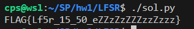
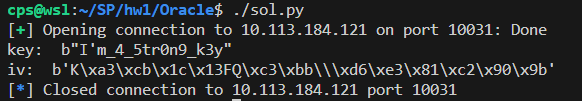
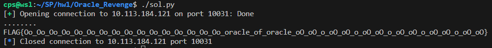
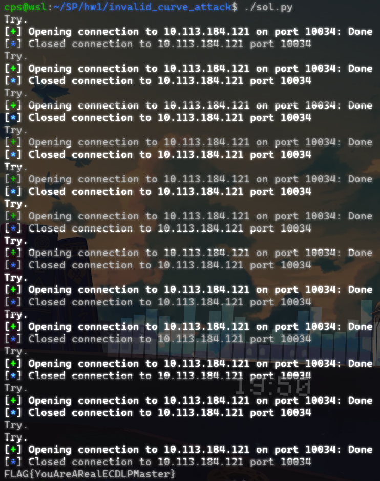
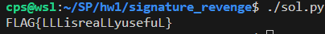
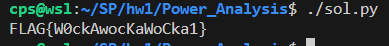

# HW1 Writeup

- 學號：`109550206`

## LFSR

- Flag：`FLAG{Lf5r_15_50_eZZzZzZZZzzZzzz}`

### 解題流程與思路
可以觀察到 lfsr 每次回合會先忽略 70 次 getbit，再 getbit 並跟 flag xor，且有多出 70 個 bit 是沒有與 flag xor 的。

**解題過程：**
1. LFSR 可以轉換成 shift matrix 的形式，將所有 bit 往後移一位，最後一列為根據 taps 看哪些 bits xor 後，回至第一位，而 matrix 運算為加法，若要符合 bitwise xor，可以將其設定為 mod 2 底下進行運算，將此 matrix 定義為 m。
    ```python
    def generate_shift_matrix(size, taps):
        result = []
        for i in range(size - 1):
            result.append([0] * size)
            result[i][i + 1] = 1
        result.append([0] * size)
        for i in taps:
            result[size - 1][i] = 1
        return Matrix(Integers(2), result)
    m = generate_shift_matrix(64, taps)
    ```
2. lfsr 有一個忽略 70 次的動作，先求一個 m^70。
    ```python
    m_70 = exponentiation_by_squaring(m, 70)
    ```
3. 再來要跳過前面有與 flag xor 的部分，跳 flag 長度次，每次為 m^71。
    ```python
    M = exponentiation_by_squaring(m * m_70, len(hint) - 70)
    ```
4. 知道 key 長度為 64 次，且其與 m 某一列相乘再相加可以得到一個值，假設 key 為 64 個變數，即為可以得到一條 64 個變數的等式，其中知道值的有最後面 70 個，因此先求出哪些 M 乘 key 之後會得出後 70 個 bit，再將該列抽出來。
    ```python
    target = []
    for i in range(64):
        M *= m_70
        target.append(M.row(0))
        M *= m
    ```
5. 抽出 64 條等式，即可以解聯立求 64 個變數的值，可以透過高斯消去快速求答案。
    ```python
    # Covert to Matrix in sage
    target = Matrix(Integers(2), target)
    # Let hint[256:256+64] be 1 x 64 column
    col = Matrix([[val] for val in hint[-70 : -70 + 64]])
    # Combine
    target = target.augment(col, subdivide=True)
    # Gaussian Elimination
    target = target.echelon_form()
    # Get key
    key = target.column(-1)
    ```
6. 得到 key 再重作一次 lfsr，並與 hint xor 即可求得 flag
    ```python
    # Do it again
    flag = []
    for _ in range(256):
        key = m_70 * key
        flag.append(int(key[0]))
        key = m * key
    # Xor with hint
    for i in range(256):
        flag[i] = (flag[i] + hint[i]) & 1
    # Get flag
    print(long_to_bytes(int("".join(map(str, flag)), 2)).decode())
    ```
7. 完整實作參照 `LFSR/sol.py`

**取得 flag 的畫面：**


## Oracle

- Flag：`FLAG{Rea11yu5efu110rac1eisntit?}`

### 解題流程與思路
可以看到 Alice 會收 RSA 加密的 key、iv 和 AES 加密的 ct，且該 AES 的 key、iv 為前面 RSA 加密傳上去的，且其會告訴我們這組 key、iv 解出來的 pt 的 padding 是否正確。這樣符合 padding oracle attack 的需求可自改 iv 去測 ct 的值，但 ct 為一張照片檔，有很多個 block，可能要解很久。因此可以改成嘗試用 padding oracle attack 去測 key、iv 的值，即可用 key、iv 直接解密照片。

**解題過程：**
1. 設法使 ct decryt 後跟 iv xor 前的東西可控，即可藉此測 iv 的值。
2. 可以發現我們其實可以自產 AES key、pt 去 encryt，並指定 iv 皆為 b'\x00'，即可使 "ct decryt 後跟 iv xor 前" 這個東西為指定的 pt。
3. 將任意使用該 RSA public key 加密的東西放至 `iv`，再自產 AES key 去枚舉 pt，再將 key 用 RSA public key 加密放至 `key`，AES key 加密後的 pt 放至 `ct`。即可測出 `iv` 的明文。
4. 而我們有原 AES key、iv 的 RSA public key 加密，藉此可以得知 AES key、iv 是多少。
    ```python
    def POA(encrypted_target, key=b'\x00'*16):
        result = []
        assert len(key) == 16
        encrypted_key = asymmetric_encryption(key, N, e)
        for i in range(16):
            tmp = b''
            for j in range(i):
                tmp += bytes([result[i - j - 1] ^ (i + 1)])
            for c in range(256):
                fake_flag = b'\x00' * (15 - i) + bytes([c]) + tmp
                _, ct = no_pad_symmetric_encryption(fake_flag, key)
                if send_to_check(encrypted_key, encrypted_target, ct) == True:
                    result.append(c ^ (i + 1))
                    break
            assert len(result) == i + 1
        return bytes(reversed(result))
    
    key = POA(encrypted_key)
    iv = POA(encrypted_iv)
    ```
5. 再用 key、iv 解圖片，即可於圖片看到 flag。
    ```python
    cipher = AES.new(key, AES.MODE_CBC, iv)
    open('flag.png', 'wb').write(unpad(cipher.decrypt(encrypted_flag)))
    ```
6. 完整實作參照 `Oracle/sol.py`。

**取得 flag 的畫面：**



## Oracle_Revenge

- Flag：`FLAG{Oo_Oo_Oo_Oo_Oo_Oo_Oo_Oo_Oo_Oo_Oo_Oo_Oo_Oo_Oo_Oo_oracle_of_oracle_oO_oO_o_oO_oO_o_oO_oO_o_oO_oO_o_oO_oO_o_oO_oO}`

### 解題流程與思路
有 Oracle 的 POA 後，即可以解 RSA 任意加密的最後 16 bytes，即滿足 LSB 條件，這題直接將 flag 用該 RSA public key 加密，可以用 LSB 將其組出來。

**解題過程：**
1. 其數學原理與 lab LSB 完全一樣只是將 `3` 換成 `pow(0x100, 16)`，以及最後餘數是回傳值變成要自己 POA，即可得 flag。
    ```python
    mod = pow(0x100, 16)
    mod_inv = pow(mod, -1, N)
    mod_inv_e = pow(mod, -e, N)
    remainder = 0
    flag = b''
    while True:
        print('.', end='')
        ret = POA(encrypted_flag)
        x = bytes_to_long(ret)
        x = (x - remainder) % mod
        flag = long_to_bytes(x) + flag
        if b'FLAG{' in flag:
            break
        encrypted_flag = encrypted_flag * mod_inv_e % N
        remainder = (remainder + x) * mod_inv % N
    ```
2. 完整實作參照 `Oracle_Revenge/sol.py`。

**取得 flag 的畫面：**


## invalid_curve_attack

- Flag：`FLAG{YouAreARealECDLPMaster}`

### 解題流程與思路
觀察可以發現 server 並沒有檢查送過的是否在它 curve 上，因此可以讓它算一些在其他 curve 上的有一個小質數 order 的點，這樣 discrete_log 可以較快解出來，並可以得到跟 flag 同餘小質數 m 的 a，多找幾個，透過中國餘式定理即可求得 flag。

**解題過程：**
1. 隨機選一個 b，用其初始化一個新 curve，並算該 cureve 的 order
    ```python
    b = randint(1, p)
    E = EllipticCurve(GF(p), [a, b])
    N = E.order()
    ```
2. 質因數分解 order ，並選一個足夠小的。
    ```python
    valid = [factor for factor in prime_factors(N) if factor <= 2**30]
    if len(valid) == 0:
        return None, None
    prime = valid[-1]
    ```
3. 產生一個以該質數為 order 的點，交給 server 算。
    ```python
    G = E.gen(0) * int(N / prime)
    node = G.xy()
    # send to server (if connected, do not interrupt)
    r = remote('10.113.184.121', 10034)
    r.recvline()
    r.sendlineafter(b'Gx: ', str(node[0]).encode())
    r.sendlineafter(b'Gy: ', str(node[1]).encode())
    data = r.recvline()
    r.close()
    ```
4. 做 discrete log，即可解出跟 flag 同餘小質數的值。
    ```python
    Q = eval(data)
    Q = E(Q[0], Q[1])
    num = G.discrete_log(Q)
    return num, prime
    ```
5. 其中可能剛好遇到質因數分解要解很久的，可以 `Ctrl+C` 跳掉，或 server 算出來有問題的可以丟掉。
6. 取得多個跟 flag 同餘小質數 m 的 a 後，使用 sgae 的 `CRT_list` 做中國餘式定理嘗試解看看是不是 flag，不是的話再多找一個再測一次。
    ```python
    while True:
        num, prime = crt_equation_generator()
        if num is None:
            continue
        nums.append(num)
        mods.append(prime)
        flag = long_to_bytes(CRT_list(nums, mods))
        if not flag.startswith(b"FLAG{"):
            continue
        try:
            print(flag.decode())
            break
        except:
            continue
    ```
8. 完整實作參照 `invalid_curve_attack/sol.py`。

**取得 flag 的畫面：**


## signature_revenge

- Flag：`FLAG{LLLisreaLLyusefuL}`

### 解題流程與思路
可以觀察到 k1, k2 為 magic1, magic2 前後組合起來的，因此 k1、k2 可以代換成 magic1、magic2 的線性組合，且根據課堂範例當得知 k 的前面很多 bits 時 (magic1, magic2 的前lenbit(magic1) 為 0)，可以造出一個方程式 `k1 + tk2 + u` 在 mod n 下同餘 0，即可造出一個 lattice 透過 LLL 求出 k1, k2。

**解題過程：**
1. 首先算出 `k1 + tk2 + u = 0 mod n` 中的 t, k。
    ```python
    t = -pow(s1, -1, n) * s2 * r1 * pow(r2, -1, n)
    u = pow(s1, -1, n)* r1 * h2  * pow(r2, -1, n) - pow(s1, -1, n) * h1
    ```
2. 將 k1, k2 代換成 magic1, magic2 (下面表示為 m1, m2)，並化簡成新的 `m1 + m2 * t1 + u1` 在 mod n 同餘 0。
    ```python
    # k1 + tk2 + u = 0 mod n
    # k1 = m1 * 2^128 + m2
    # k2 = m2 * 2^128 + m1
    # m1 * 2^128 + m2 + (m2 * 2^128 + m1)t + u = 0 mod n
    # m1 * (2^128 + t) + m2 * (1 + t * 2^128) + u = 0 mod n
    # m1 * (2^128 + t) + m2 * (1 + t * 2^128) = -u mod n
    # m1 * (2^128 + t) = -u - m2 * (1 + t * 2^128) mod n
    # m1 = (-u - m2 * (1 + t * 2^128)) * (2^128 + t)^(-1) mod n
    # m1 + m2 * (1 + t * 2^128) * (2^128 + t)^(-1) = -u * (2^128 + t)^(-1) mod n
    # m1 + m2 * (1 + t * 2^128) * (2^128 + t)^(-1) + u * (2^128 + t)^(-1) = 0 mod n
    t1 = (1 + t * pow(2, 128)) * pow(pow(2, 128) + t, -1, n)
    u1 = u * pow(pow(2, 128) + t, -1, n)
    # m1 + m2 * t1 + u1 = 0 mod n
    ```
3. 構出 lattice 解 LLL。
    ```python
    n, t1, u1, K = int(n), int(t1), int(u1), pow(2, 128)
    M = [
            [n, 0, 0],
            [t1, 1, 0],
            [u1, 0, K],
        ]
    L = matrix(M).LLL()
    ```
4. 取出 (-m1, m2, K)，重組回 k1, k2。
    ```python
    target = None
    v = []
    for i in range(3):
        if L[i][2] == K:
            target = L[i]
        elif L[i][2] == 0:
            v.append(L[i])
    
    if target:
        M1 = -target[0]
        M2 = target[1]
    else:
        print(L)
        print("LLL Not Found")
        exit(1)
    
    m1 = long_to_bytes(M1)
    m2 = long_to_bytes(M2)
    k1 = bytes_to_long(m1 + m2)
    k2 = bytes_to_long(m2 + m1)
    ```
5. 反解 d。
    ```python
    # s1 = k1^(-1)(h1 + d * r1) mod n
    # s1 * k1 = h1 + d * r1 mod n
    # s1 * k1 - h1 = d * r1 mod n
    # s1 * k1 * r1^(-1) - h1 * r1^(-1) = d mod n
    
    d = int(s1 * k1 * pow(r1, -1, n) - h1 * pow(r1, -1, n))
    assert d == int(s2 * k2 * pow(r2, -1, n) - h2 * pow(r2, -1, n))
    ```
6. 確認 d 再 md5 後是否為 m1。
    ```python
    if m1 == md5(d.to_bytes(32, "big")).digest() and m2 == md5(d.to_bytes(32, "big")[::-1]).digest():
        flag = b'FLAG{' + long_to_bytes(d).split(b'FLAG{')[1]
        print(flag.decode())
        exit()
    ```
7. 若不是，觀察 L 再做一些簡單的線性組合嘗試看看。
    ```python
    print(L)
    # vt + c * v[i]
    coefficient = 5
    for i in range(len(v)):
        for j in range(1, coefficient):
            m1 = long_to_bytes((M1 + -v[i][0] * j) % n)
            m2 = long_to_bytes((M2 + v[i][1] * j) % n)
            k1 = bytes_to_long(m1 + m2)
            k2 = bytes_to_long(m2 + m1)
    
            d = int(s1 * k1 * pow(r1, -1, n) - h1 * pow(r1, -1, n))
            
            if m1 == md5(d.to_bytes(32, "big")).digest() and m2 == md5(d.to_bytes(32, "big")[::-1]).digest():
                flag = b'FLAG{' + long_to_bytes(d).split(b'FLAG{')[1]
                print(flag.decode())
                exit()
    ```
8. 因為目標 vector 足夠小，理論上算出來的 basis 應該簡單組一下可以找到。
9. 另外觀察 lattice 可以發現 n 乘上一些倍數也會對，對應的應該會影響 k1、k2 的一些關係，剛好發現 3 * n 可以剛好找到 flag。
    ```python
    M = [
            [3 * n, 0, 0],
            [t1, 1, 0],
            [u1, 0, K],
        ]
    ```
10. 完整實作參照 `signature_revenge/sol.py`。

**取得 flag 的畫面：**


## Power_Analysis

- Flag：`FLAG{W0ckAwocKaWoCka1}`

### 解題流程與思路
根據上課老師的說明，照著 CPA workflow 做應該可以分析出 AES 的 key 是多少。

**解題過程：**
1. 從 Step 2: Measure the power traces (record data) 開始，json 檔已經幫我們紀錄好這些資料了，共有 50 筆 (先讀進來確認過)。
    ```python
    with open('chall/stm32f0_aes.json') as f:
        data = json.load(f)
    
    '''
    print('type(data): ',type(data))
    print('len(data): ',len(data))
    print('type(data[0]): ',type(data[0]))
    print('len(data[0]): ',len(data[0]))
    print('data[0].keys(): ',data[0].keys())
    print('data[0]["pt"]: ',data[0]['pt'])
    print('data[0]["ct"]: ',data[0]['ct'])
    print('type(data[0]["pm"]): ',type(data[0]['pm']))
    print('len(data[0]["pm"]): ',len(data[0]['pm']))
    print('data[0]["pm"][0]: ',data[0]['pm'][0])
    '''
    ```
2. Calculate hypothetical intermediate value Sbox (p ⊕ k)：
    - 取每個 plantexts 的 first byte 為 p (50 x 1)
    - 取 0x00 ~ 0xff 為 k (1 x 256)
    - 對每個組合進行 Sbox (p ⊕ k)，得到一個矩陣 (50 x 256) 
3. Calculate the hypothetical intermediate value:
    - 計算矩陣中每個值的 bit 中有幾個 1
    ```python
    result = []
    for i in range(D):
        tmp = []
        for j in range(K):
            index = data[i]['pt'][t] ^ j
            tmp.append(count_set_bits(sbox[index]))
        result.append(tmp)
    hypo = np.array(result)
    ```
4. corresponding hypothetical power consumption:
    - 跟 traces 資料進行 corrlation
    - 得到 256 x 1806 的 Correlation coefficients matrix
    - 取其中值最大的紀錄，再取其最大的對應的 index 即為 key 第一個 byte 推測出的值。
    ```python
    result = []
    for i in range(K):
        hypo_col = hypo[:,i]
        corrs = []
        for j in range(T):
            trace_col = trace[:,j]
            corrs.append(np.corrcoef(trace_col, hypo_col)[0,1])
        result.append(max(corrs))
    
    c = np.argmax(result)
    c = chr(c)
    print(c,end='')
    sys.stdout.flush()
    ```
5. 上述 2 - 4 針對 16 個 bytes 都做一遍，即可推測出 key 的值，前後包上 `FLAG{}` 即為 flag。
6. 完整實作參照 `Power_Analysis/sol.py`。

**取得 flag 的畫面：**
