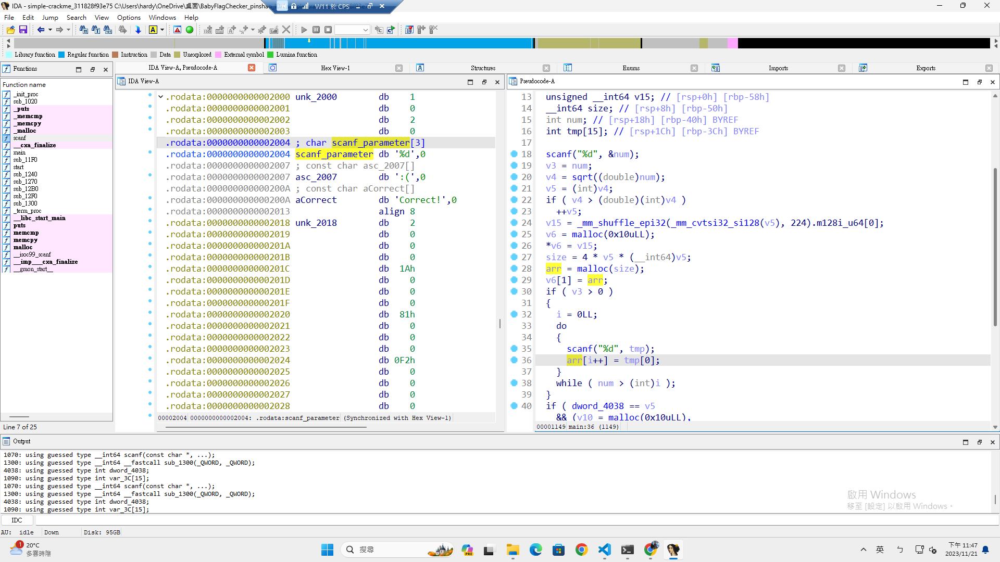
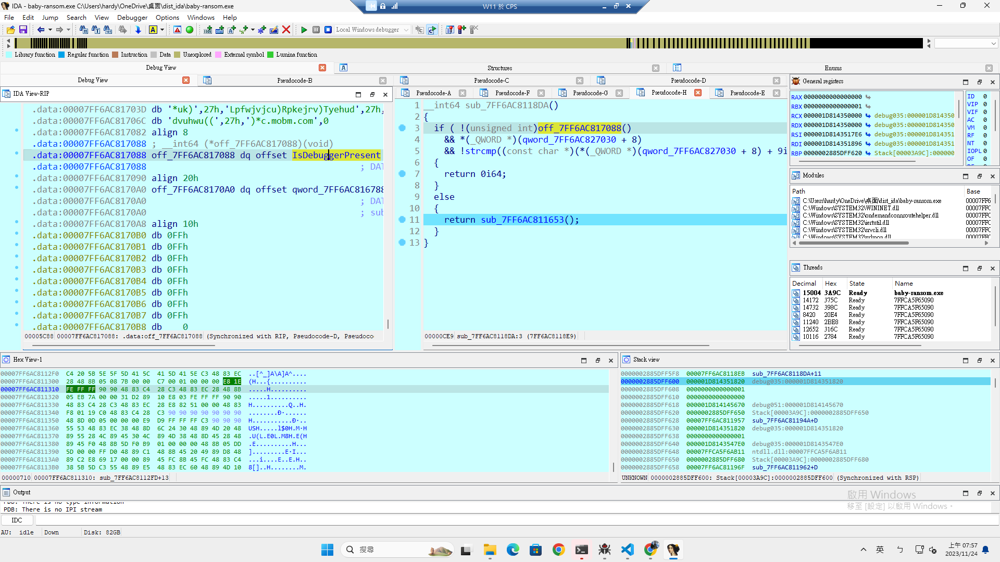
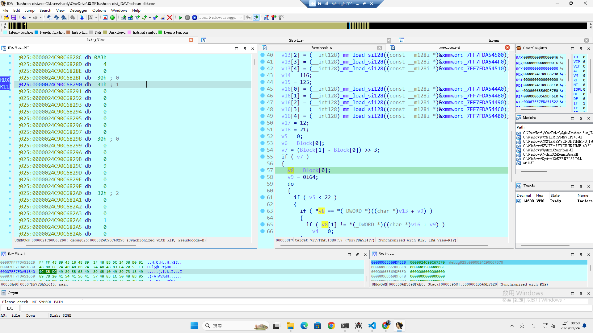

# HW2 Writeup

- 學號：`109550206`

## crackme_vectorization

- Flag：`FLAG{yOu_kn0w_hOw_to_r3v3r53_4_m47riX!}`

### 解題流程與思路
IDA 開起來，靜態看程式在做什麼。

**解題過程：**
1. IDA 開起來，F5 decompile 後，進到 main。
    

2. 先看到 `__isoc99_scanf`，調整其參數狀態 (應為 scanf("...", a1, a2))。
    

3. 再看到 `v17`，似乎在後面的迴圈輸入，視為數量條件。且 `v7` 和 `v8` 似乎
相等為存 num 個整數輸入的 array，且 `v18` 純粹當作存單個數入的 tmp。 
    

4. 再來看到 num 之後有被開根號並存成 int，並與 IDA 自動識別為 size 的變數有關，可以等價於 4 * num，可以猜測為 sizeof(int) * num。
    

5. 再來看到 corect 的條件可以知道 sqrt(num) == 7，故 num 可能為 49，且剛好發現 `src`、`s2` 似乎是指向些陣列的指標 (memcpy, memcmp)。
    

6. 把指向的兩段陣列修好，根據 `size_num_sizeof_int` 可以知道其為 49 個 int 陣列。
    

7. 後來修一修，知道 Z 要跟 ptr_20E0 一樣，且其為 `sub_1300(X, Y)` ，而 X 即為 ptr_2018，Y 即為輸入的 49 個數字。 
    

8. 後來看了很解 `sub_1300(X, Y)`，也沒看出什麼，觀察 X 跟 Z 以 7 * 7 = 49，通靈其為矩陣乘法。寫 script 反算 Y。
    ```python
    import numpy as np

    X = np.array([[2, 26, 129, 242, 0, 193, 154],
                [205, 11, 128, 176, 87, 255, 226],
                [70, 93, 81, 4, 236, 166, 107],
                [239, 221, 202, 90, 225, 168, 14],
                [46, 120, 238, 158, 163, 96, 196],
                [7, 175, 188, 132, 27, 86, 58],
                [193, 163, 108, 18, 4, 108, 119]])

    Z = np.array([[55567, 63994, 71094, 73276, 73083, 56652, 41458],
                [91261, 94932, 104521, 94720, 101004, 84275, 62906],
                [67330, 58202, 62059, 68206, 65795, 51680, 47909],
                [99958, 91343, 96657, 105418, 96001, 87849, 79582],
                [79580, 76563, 87686, 103105, 93377, 72054, 56979],
                [51218, 49157, 54679, 72208, 59773, 50129, 39656],
                [62922, 55842, 62347, 65425, 59209, 56916, 39189]])

    try:
        X_inv = np.linalg.inv(X)
    except np.linalg.LinAlgError:
        X_inv = None
        print("Matrix is not invertible")

    Y = np.dot(X_inv, Z)

    Y = Y.flatten().tolist()

    for c in Y:
        print(chr(int(c + 0.5)), end='')
    print()
    ```
9. 算出來一個看起來很 `base64`的字串 (不是)，丟至網站就有 Flag 了。
    

**取得 flag 的畫面：**


## Banana Donut Verifier

- Flag：`FLAG{d0_Y0u_l1k3_b4n4Na_d0Nut?}`

### 解題流程與思路
IDA 開起來，靜態看程式在做什麼。動態跑起來確認。

**解題過程：**
1. 要輸入一個 1023 長度的字串。
    

2. 將其跟記憶體中的某段字串再經過某一個 func 後的回傳值進行比較。
    

3. func 的內容是把字串當 index 查表 xor。 
    

4. input 在過程中會跟某些東西 xor，但中間過程複雜。 
    

5. 直接跑起來，會得知最後面的輸出內容為香蕉，前面複雜的運算為會動的甜甜圈，input 跟過程中的某些參數 xor 後應該要跟另外一段字串一樣。
    

6. 原本想直接寫一份一樣的 code，並在跑的過程記下，過程中重要參數，結果中間跑去 dump `Unpackme`，雖然仍然不會脫殼，但想到可以動態撈變化後的字串出來。

7. 設好 break point 在進 xor_checker 前，撈出傳入的字串指標 (存在 `rdi` 中)，並從記憶體中 dump 該段字串出來。輸入隨意給一個 1023 的字串 (再 xor 掉就好)。
    
    

8. 停在 xor_checker 前，dump $rdi ~ $rdi+1024
    

9. 同樣手法 dump 要比較的字串 (原本從靜態出撈，結果撈錯)。
    ```
    > gdb ./dount-verifier
    pwndbg> starti
    pwndbg> b *$rebase(0x16cf)
    pwndbg> conti
    Dount Verifier
    Input:111111111111111111111111111111111111111111111111111111111111111111111111111111111111111111111111111111111111111111111111111111111111111111111111111111111111111111111111111111111111111111111111111111111111111111111111111111111111111111111111111111111111111111111111111111111111111111111111111111111111111111111111111111111111111111111111111111111111111111111111111111111111111111111111111111111111111111111111111111111111111111111111111111111111111111111111111111111111111111111111111111111111111111111111111111111111111111111111111111111111111111111111111111111111111111111111111111111111111111111111111111111111111111111111111111111111111111111111111111111111111111111111111111111111111111111111111111111111111111111111111111111111111111111111111111111111111111111111111111111111111111111111111111111111111111111111111111111111111111111111111111111111111111111111111111111111111111111111111111111111111111111111111111111111111111111111111111111111111111111111111111111111111111111111111111111111111111111111111111111111111
    pwndbg> dump memory input 0x7ffffffede40 0x7ffffffede40+0x400
    pwndbg> dump memory data 0x8002010 0x8002010+0x400
    ```

10. xor 復原 input。
    ```python
    from pwn import *
    r = process(['/usr/bin/cat','./input'])
    input = r.recv()
    r = process(['/usr/bin/cat','./data'])
    data = r.recv()
    flag = ''
    for i in range(1024):
        flag += chr(input[i] ^ data[i] ^ ord('1'))
    print(flag.encode())
    ```
    

11. 就取得一樣像個 base64 的東西，放到網站上就可以拿到 flag。
    `zls4wq/r/wzzU5gE1yAxN5crfXOCZGJUO0SceVFgRNRDfjc=`

**取得 flag 的畫面：**


## Baby Ransom 1 -- Next Stage Payload

- Flag：`FLAG{e6b77096375bcff4c8bc765e599fbbc0}`

### 解題流程與思路

**解題過程：**
1. IDA 開起來慢慢看，最後看到 `WriteProcessMemory`。可以猜到應該就在附近了，然後看實際寫的狀況，可以發現是前一個 func 進去才是主要在寫得地方，且其內容與 lab 不同，是經過一些運算才拿得到，而進行運算的地方在前面一點的 generate_data 裡。
    

2. 所以就動態跟到其做完，再 dump 其目標地方、大小的 raw data。
    

3. 但是沒那麼容易進去，一開始在 `WriteProcessMemory` 附近設 breakpoint。但發現撞不到，就結束了，往前找才發現有這段檢測是不是在被 debug 的片段，將其 patch 成在 debug 的才做，就能進到前述的地方。
    

4. 將 dump 出來的資料做 md5sum 就可拿到 flag。

**取得 flag 的畫面：**


## Baby Ransom 2 -- Encrypted File

- Flag：``

### 解題流程與思路

**解題過程：**

**取得 flag 的畫面：**

## Evil FlagChecker

- Flag：``

### 解題流程與思路

**解題過程：**

**取得 flag 的畫面：**

## Trashcan

- Flag：``

### 解題流程與思路

**解題過程：**
1. 一開始靜態，一直修不好這東西。


2. 後來動態進去發現裡面有一段變數存的資料跟 FLAG 很像。
    

3. 且後面有對其進行比對，且比對對象為輸入資料 v8，似乎經過前面的 magic func 會對輸入進行某些條件 swap 使其與 v13 們存的資料順序一樣。原本嘗試給 22 有序字元觀察其重排狀況，但發現其並沒有如預期的排好。
    

4. 後來嘗試 angr，爛掉，沒修好。
    ```python
    import angr
    import claripy
    import logging

    logging.getLogger('angr.sim_manager').setLevel(logging.DEBUG)

    proj = angr.Project('./Trashcan-dist.exe', auto_load_libs=False)

    stdin = claripy.BVS('stdin', 8 * 22)

    state = proj.factory.entry_state(stdin=stdin)

    simgr = proj.factory.simulation_manager(state)

    simgr.explore(find=lambda s: b'Trashcan accept your input\n' in s.posix.dumps(1))

    if len(simgr.found) > 0:
        print(simgr.found[0].solver.eval(stdin, cast_to=bytes) )
    else:
        print("No!")
    ```

**取得 flag 的畫面：**


