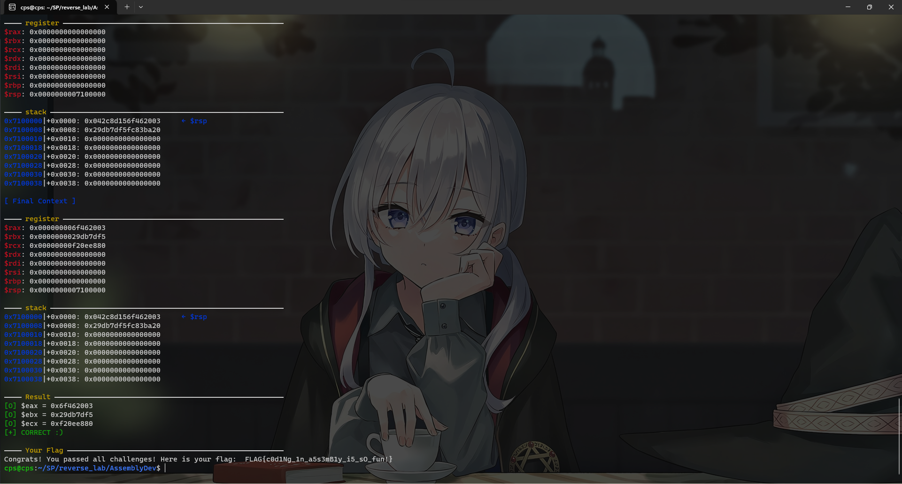
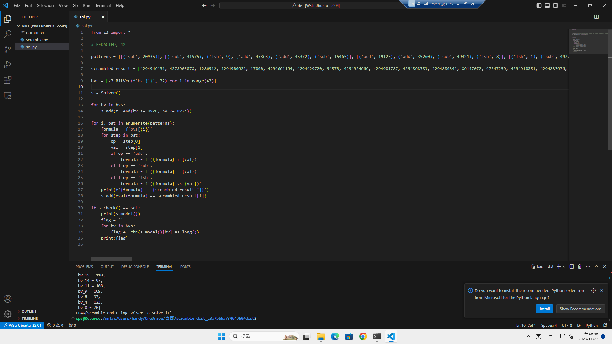
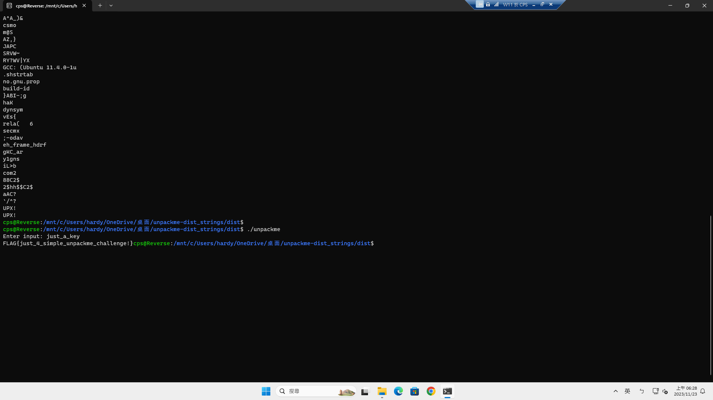

# Reverse Lab Writeup

- 學號：`109550206`

## AssemblyDev

- Flag：`FLAG{c0d1Ng_1n_a5s3mB1y_i5_sO_fun!}`

### 解題流程與思路
上課講過就是，根據指示撰寫對應的 Assembly 並交上去。

**解題過程：**
1. 第一題
    ```python
    ;let a = MEM[RSP+0x0:RSP+0x4]
    ;let b = MEM[RSP+0x4:RSP+0x8]
    mov r8d, dword [rsp+0x0]
    mov r9d, dword [rsp+0x4]
    ;EAX = a + b
    mov eax, r8d
    add eax, r9d
    ;EBX = a - b
    mov ebx, r8d
    sub ebx, r9d
    ;let c = MEM[RSP+0x8:RSP+0xc]
    ;ECX = -c
    mov ecx, dword [rsp+0x8]
    neg ecx
    ;EDX = 9*a + 7
    mov edx, r8d
    imul edx, 0x9
    add edx, 0x7
    ```
2. 第二題
    ```python
    ;RAX += 0x87
    add rax, 0x87
    ;RBX -= 0x63
    sub rbx, 0x63
    ;RCX, RDX = RDX, RCX
    mov rdi, rdx
    mov rdx, rcx
    mov rcx, rdi
    ;MEM[RSP+0x0:RSP+0x4] += 0xdeadbeef
    mov r8d, dword [rsp]
    add r8d, 0xdeadbeef
    mov [rsp], r8d
    ;MEM[RSP+0x4:RSP+0x8] -= 0xfaceb00c
    mov r8d, dword [rsp+4]
    sub r8d, 0xfaceb00c
    mov [rsp+0x4], r8d
    ;MEM[RSP+0x8:RSP+0xc], MEM[RSP+0xc:RSP+0x10] = MEM[RSP+0xc:RSP+0x10], MEM[RSP+0x8:RSP+0xc]
    mov r8d, dword [rsp+0x8]
    mov r9d, dword [rsp+0xc]
    mov [rsp+0x8], r9d
    mov [rsp+0xc], r8d
    ```
3. 第三題，這題一開始就隨一各挑一種結果，多骰幾次 1/8 就拿到 flag 了。後來才補寫好。
    ```python
    Q1:
        mov r8d, dword [rsp+0x0]
        mov r9d, dword [rsp+0x4]
        cmp r8d, r9d
        jge EAX_a
    EAX_b:
        mov eax, r9d
        jmp Q2
    EAX_a:
        mov eax, r8d
    Q2:
        mov r8d, dword [rsp+0x8]
        mov r9d, dword [rsp+0xc]
        cmp r8d, r9d
        jb EBX_c
    EBX_d:
        mov ebx, r9d
        jmp Q3
    EBX_c:
        mov ebx, r8d
    Q3:
        mov ecx, r8d
        test r8d, 0x1
        jnz odd
    even:
        mov ecx, r8d
        shl ecx, 0x2
        jmp fin
    odd:
        shr ecx, 0x3
    fin:
    ```
4. 連線上傳，就會吐 flag 了。
    ```bash
    #!/bin/bash
    p1=`cat p1.asm | base64 -w0`
    p2=`cat p2.asm | base64 -w0`
    p3=`cat p3.asm | base64 -w0`
    printf "$p1\n$p2\n$p3\n" | nc edu-ctf.zoolab.org 10020
    ```
**取得 flag 的畫面：**


## HelloRevWorld

- Flag：`FLAG{h311O_revers1ng_3ngineer5}`

### 解題流程與思路
直接跑起來就拿到了，非常錯愕。

**解題過程：**
1. 直接跑。應該養成習慣先靜態看看?
    ```
    ./helloworld
    ```

**取得 flag 的畫面：**


## Clipboard Stealer 1 -- sub_140001C80

- Flag：`FLAG{T1547.009}`

### 解題流程與思路
跟著上課就會知道其行為，再去找其編號：https://attack.mitre.org/techniques/T1547/009/。

**解題過程：**
1. IDA 觀察一下可以發現他將其複製到 Starup Floder，並藏起來。
2. 得知其行為去找編號。

**取得 flag 的畫面：**


## Clipboard Stealer 2 -- sub_140001030

- Flag：`FLAG{T1480}`

### 解題流程與思路
跟著上課就會知道其行為，再去找其編號：https://attack.mitre.org/techniques/T1480/。

**解題過程：**
1. IDA 看一下，可以得知其在等系統時間在特定時間後，才開始執行。
2. 得知其行為去找編號。

**取得 flag 的畫面：**


## Clipboard Stealer 3 -- sub_140001120

- Flag：`FLAG{th15_I4_4_mut3x_k1LL_SwitcH}`

### 解題流程與思路

**解題過程：**
1. IDA 看一下就會發現其為某兩個東西 xor 的結果，將其實作即可得到 mutex name。
    ```
    key = (0x6463627A).to_bytes(4, 'little')
    xor_name = bytes([0x0E, 0x0A,0x52,0x51,0x25,0x2B,0x57,0x3B,0x4E,0x3D,0x0E,0x11,0x0E,0x51,0x1B,0x3B,0x11,0x53,0x2F,0x28,0x25,0x31,0x14,0x0D,0x0E,0x01,0x2B,0x64])

    name = bytearray()
    for i in range(len(xor_name)):
        name.append(key[i % 4] ^ xor_name[i])
    print(name.decode())
    ```

**取得 flag 的畫面：**


## Clipboard Stealer 4 -- Extract Next Stage Payload

- Flag：`FLAG{462fe0007f86957f59824e113f78947c}`

### 解題流程與思路

**解題過程：**
1. IDA 追到其要嵌入 edge 的部分。將其 dump 出來，並算 md5，即為 flag。

**取得 flag 的畫面：**


## Clipboard Stealer 5 -- Exfiltrate Data

- Flag：`FLAG{C2_cU540m_Pr0t0C01}`

### 解題流程與思路

**解題過程：**
1. IDA 看一看可以得知其向外建 TCP 連線並傳了 RC4 加密的資料。
2. 提供的 pcap 檔，前面為 TCP 握手至第六個封包為可以看到 `11788711`，並於第 8、11 個封包可以找到 key、data， 
    
3. 透過 CyberChef 網站可以解密，即得到 flag。

**取得 flag 的畫面：**


## Clipboard Stealer 6 -- Dynamic API Resolution

- Flag：`FLAG{MessageBoxA}`

### 解題流程與思路

**解題過程：**
1. IDA 進去可以看到為防止偵測到使用某些 API，所以用某種 hash 方式記要用的 API name 再去搜，hash 後跟該值一樣的 API 來用。
2. hash 所有 API 找該 API 為何。
    ```python
    def rol(v, b,  bit_size):
        return (v << b) | (v >> (bit_size - b) & (2**(bit_size) - 1))

    with open("./user32.dll.txt", 'rb') as f:
        names = f.read().split(b'\n')

    for name in names:
        name = name.strip()
        h = 0
        for i in range(len(name)):
            h += rol(h, 11, 32) + 1187 + name[i]
            h = h & (2**(32) - 1)
        if h == 0x416f607:
            print(name)
            break
    ```
**取得 flag 的畫面：**


## Scramble

- Flag：`FLAG{scramble_and_using_solver_to_solve_it}`

### 解題流程與思路
z3!!!

**解題過程：**
1. 根據上課，z3 一些條件他可以嘗試求解，將 `scramble.py` 生成條件式，轉成 z3 看得懂的格式，求解，即可以得到 flag。
    ```python
    from z3 import *

    # REDACTED, 42

    patterns = [[('sub', 20935)], [('sub', 31575), ('lsh', 9), ('add', 45363), ('add', 35372), ('sub', 15465)], [('add', 19123), ('add', 35260), ('sub', 49421), ('lsh', 8)], [('lsh', 1), ('sub', 4977), ('sub', 55837)], [('add', 16937)], [('sub', 56984), ('lsh', 2), ('sub', 32363), ('sub', 46293)], [('sub', 94), ('sub', 48860), ('sub', 18342), ('lsh', 3)], [('add', 37549), ('sub', 36283), ('lsh', 6), ('add', 6253)], [('add', 34661), ('sub', 13281), ('sub', 64107)], [('sub', 8525), ('sub', 30349), ('sub', 26744)], [('lsh', 2), ('sub', 18120), ('sub', 63091), ('add', 17287), ('sub', 37618), ('add', 2237)], [('sub', 48573), ('sub', 4449), ('add', 36013), ('sub', 64051)], [('add', 10415), ('lsh', 3), ('lsh', 10)], [('add', 5676), ('lsh', 3), ('lsh', 10), ('add', 32002), ('sub', 60775)], [('add', 35939), ('sub', 32666), ('sub', 45639), ('add', 2077), ('sub', 16253)], [('sub', 30392), ('sub', 26913), ('sub', 14009), ('sub', 62416)], [('sub', 15056), ('sub', 40527)], [('lsh', 5)], [('lsh', 1), ('sub', 16070)], [('add', 2045)], [('lsh', 8), ('add', 37087), ('sub', 22013), ('lsh', 10), ('lsh', 2)], [('add', 31880), ('sub', 56557), ('lsh', 6), ('lsh', 5), ('lsh', 8), ('add', 15535)], [('add', 22937), ('add', 4060)], [('add', 8462), ('sub', 4463), ('sub', 45810), ('lsh', 1)], [('sub', 10144), ('lsh', 8), ('lsh', 5), ('lsh', 1), ('lsh', 8)], [('add', 49937), ('lsh', 2), ('add', 60982), ('sub', 24799)], [('lsh', 4), ('add', 53340), ('add', 50619), ('sub', 56111), ('add', 6134), ('lsh', 1)], [('sub', 22577), ('sub', 50645)], [('add', 21265), ('sub', 41440)], [('add', 63314), ('sub', 45755), ('add', 62216)], [('sub', 52616)], [('add', 21192)], [('add', 62573), ('sub',18811)], [('add', 35452), ('sub', 11573), ('sub', 49079), ('sub', 36361), ('sub', 26862), ('lsh', 9)], [('add', 13610), ('lsh', 7), ('lsh', 3), ('sub', 28490), ('lsh', 10), ('add', 44742)], [('lsh', 10), ('sub', 1797), ('sub', 10564), ('add', 12394)], [('add', 45165), ('lsh', 10), ('sub', 60610), ('sub', 63002), ('sub', 14851), ('lsh', 1)], [('add', 34840), ('lsh', 3), ('sub', 16907)], [('add', 4404), ('lsh', 3), ('lsh', 7), ('lsh', 6)], [('lsh', 6), ('add', 51738), ('sub', 24621), ('add', 58646)], [('lsh', 1)], [('add', 29375), ('sub', 419), ('add', 2854), ('sub', 11878), ('lsh', 10), ('add', 40151)], [('add', 22953)]]

    scrambled_result = [4294946431, 4278905078, 1286912, 4294906624, 17060, 4294661164, 4294429720, 94573, 4294924666, 4294901787, 4294868383, 4294886344, 86147072, 47247259, 4294910851, 4294833676, 4294911813, 3040, 4294951460, 2160, 171843584, 4734127, 27100, 4294883864, 884998144, 236375, 111420, 4294894192, 4294947222, 79889, 4294914775, 21308, 43873, 4249743360, 1477674694, 113697, 92442178, 262757, 295239680, 91843, 210, 20569303, 23078]

    bvs = [z3.BitVec(f'bv_{i}', 32) for i in range(43)]

    s = Solver()

    for bv in bvs:
        s.add(z3.And(bv >= 0x20, bv <= 0x7e))

    for i, pat in enumerate(patterns):
        formula = f'bvs[{i}]'
        for step in pat:
            op = step[0]
            val = step[1]
            if op == 'add':
                formula = f'({formula} + {val})'
            elif op == 'sub':
                formula = f'({formula} - {val})'
            elif op == 'lsh':
                formula = f'({formula} << {val})'
        print(f'{formula} == {scrambled_result[i]}')
        s.add(eval(formula) == scrambled_result[i])

    if s.check() == sat:
        print(s.model())
        flag = ''
        for bv in bvs:
            flag += chr(s.model()[bv].as_long())
        print(flag)
    ```
**取得 flag 的畫面：**


## Super Angry

- Flag：`FLAG{knowing_how_2_angr!}`

### 解題流程與思路
angr!!!

**解題過程：**
1. 根據上課教學，IDA 得知 input，output 後，且過程不複雜和 call 很多 libary，都可以直接丟 angr 解看看，如下方式即有機會可以解出來。
    ```python
    import angr
    import claripy
    import logging

    logging.getLogger('angr.sim_manager').setLevel(logging.DEBUG)

    proj = angr.Project('./super_angry', auto_load_libs=False)

    sym_argv = claripy.BVS('sym_argv', 8 * 32)

    state = proj.factory.entry_state(args=[proj.filename, sym_argv])

    simgr = proj.factory.simulation_manager(state)

    simgr.explore(find=lambda s: b'Correct!' in s.posix.dumps(1))

    if len(simgr.found) > 0:
        print(simgr.found[0].solver.eval(sym_argv, cast_to=bytes) )
    else:
        print("No!")
    ```
**取得 flag 的畫面：**


## Unpackme

- Flag：`FLAG{just_4_simple_unpackme_challenge!}`

### 解題流程與思路
嘗試脫殼，但其實 strings 就拿到了。

**解題過程：**
1. 據上課說的地方跳進去 dump，再 disasm，看不出個所以然，動態跟著跳，發現在到處 jump，偶爾幾個大 jump 反覆跳原本的 code section 和 上課說的地方
，最後跳進 libc 跟不下去。然後在嘗試重組 ELF 時，發生下面的事情。

2. 查脫殼教學時，偶然看到使用了 `strings`。才想起這個工具，然後就試了一下，然後...
    

3. 看到了一個 `key?` 而且附近還有 `Enter input:`，那就試試看吧，然後就拿到 flag 了，但還是不會脫殼。

**取得 flag 的畫面：**
